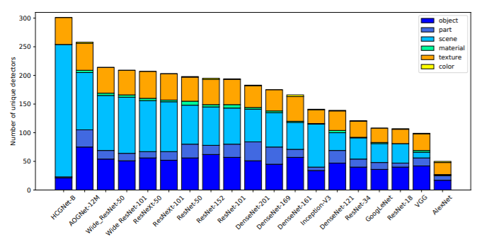


# HCGNets: Gated Convolutional Networks with Hybrid Connectivity for Image Classification

This project provides source code for our AAAI2020 paper HCGNet, the final paper will come soon.


## Installation

### Requirements

Ubuntu 16.04 LTS

Python 3 ([Anaconda](https://www.anaconda.com/) is recommended)

CUDA 9 or newer

PyTorch 0.4 or newer

NVIDIA [NCCL](https://docs.nvidia.com/deeplearning/sdk/nccl-install-guide/index.html)

[Foolbox](https://github.com/bethgelab/foolbox)

[MMDection](https://github.com/open-mmlab/mmdetection)

### Clone the repo
```
$ git clone https://github.com/winycg/HCGNet.git
$ cd HCGNet
```

### Some tweaks

USE pillow-simd to speed up pytorch image loader (assume Anaconda is used)

```
$ pip uninstall pillow
$ conda uninstall --force jpeg libtiff -y
$ conda install -c conda-forge libjpeg-turbo
$ CC="cc -mavx2" pip install --no-cache-dir -U --force-reinstall --no-binary :all: --compile pillow-simd
```

## Perform training on CIFAR dataset
### Training
```
python main_cifar.py --dataset cifar10 --arch HCGNet_A1
```
### Results
| Model | Params | FLOPS | CIFAR-10 | CIFAR-100 | 
| - | - | - | - | - |
| HCGNet-A1 | 1.1M | 0.16G |3.15 | 18.13 |
| HCGNet-A2 | 3.1M | 0.50G |2.29 | 16.54 |
| HCGNet-A3 | 11.4M | 1.99G |2.14 | 15.96 |


## Perform training and evaluation on ImageNet dataset

### Dataset preparation

- Download the ImageNet dataset to YOUR_IMAGENET_PATH and move validation images to labeled subfolders
    - The [script](https://raw.githubusercontent.com/soumith/imagenetloader.torch/master/valprep.sh) may be helpful.

- Create a datasets subfolder under your cloned HCGNet and a symlink to the ImageNet dataset

```
$ cd HCGNet
$ mkdir data
$ ln -s PATH_TO_YOUR_IMAGENET ./data/
```

### Training

```
python -m torch.distributed.launch --nproc_per_node=2 main_imagenet.py --arch HCGNet_B --gpu-id 0,1
```
Need NCCL library:

- `--nproc_per_node` : Your GPU number for training.
### Evaluation
When the training finishes, the best model file  `HCGNet_B_best.pth.tar` is saved in `./checkpoint/`.
```
python -m torch.distributed.launch --nproc_per_node=2 main_imagenet.py --arch HCGNet_B --gpu-id 0,1 --resume --checkpoint ./checkpoint/HCGNet_B_best.pth.tar --evaluate 
```

### Results
| Model | Params | FLOPS | Top-1 | Top-5 | Pretrained model|
| - | - | - | - | - |- |
| HCGNet-B | 12.9M | 2.0G |21.5 | 5.9 |[HCGNet_B_best.pth.tar](https://drive.google.com/file/d/1foA9pa4KZopzMMihGudBCE6B1C_-p1W0/view?usp=sharing)|
| HCGNet-C | 42.2M | 7.1G |19.5 | 4.8 |Coming soon|

## Interpretability by network dissection
### Reference
Network dissection method is proposed by
[Network Dissection: Quantifying Interpretability of Deep Visual Representations](https://arxiv.org/abs/1711.05611) paper. Our experiemnts refer the official implementation: https://github.com/CSAILVision/NetDissect-Lite

### Evaluation
Evaluation on interpretability based on the ImageNet pretrained model HCGNet-B:
```
cd network_dissection/
python main.py
```
You may only modify the `settings.py` and `loader/model_loader.py` to implement your requirements.

### Results
Generated result files of HCGNet_B can be downloaded [Here](https://drive.google.com/open?id=1m36qWd1Py_HTDoN8UNEftKdIegPj0Olj).
We compare the unique detectors of HCGNet-B against other popular SOTA models as follows:



## Adversarial robustness by FGSM attack
### Reference
FGSM (Fast gradient sign mthod) is proposed by
[Explaining and harnessing adversarial examples](https://arxiv.org/pdf/1412.6572.pdf) paper. Our experiemnts refer the implementation by [foolbox](https://github.com/bethgelab/foolbox) .

### Evaluation
Evaluation on adversarial robustness based on ImageNet pretrained models: HCGNet-B and other popular networks:
```
cd FGSM_attack/
python attack.py
```

### Results
Attack models with different perturbation energies：0.001~0.005. We report top-1 accuracy on ImageNet validation set after attacking.

| Model | 0.000| 0.001 | 0.002 | 0.003 | 0.004 | 0.005|
| - | - | - | - | - |- | - |
| ResNet-50| 0.762 | 0.384 |0.228 | 0.158|0.121|0.102 |
| DenseNet-169 | 0.760 | 0.353 | 0.194 | 0.125|0.094|0.077|
| ResNeXt-50  | 0.776  | 0.382  |  0.239 |    0.177 | 0.148 | 0.131 |
|Wide ResNet-50| **0.785**  | 0.439  |  0.279 | 0.202 | 0.162 | 0.139 |
|HCGNet-B| **0.785**  | **0.480**  | **0.415**  | **0.386**  | **0.370** | **0.360** |


## Object detection and segmentation
We experiment HCGNet-B pretrained on ImageNet as a backbone on the Mask-RCNN system to implement object detection and instance segmentation tasks.
### Prerequisites:
You need to install [MMDection](https://github.com/open-mmlab/mmdetection) at first and obtain a `mmdetection` folder.  Then you need to move the  `detection/hcgnet.py`  and `detection/__init__.py` to `mmdetection/mmdet/models/backbones/` , as well as `detection/hcgnet_config.py` to `mmdetection/configs/` in your  folder.  
### Training

```
./tools/dist_train.sh configs/hcgnet_config.py 2 --validate
```
- 2 means your GPU number
### Evaluation
You can download our pretrained detection and segmentation model file from [HCGNet_detection.pth](https://drive.google.com/open?id=19-zoPCX5ZywTcg1Z9QQAj5mAEo8wraoi). You need to configure the path of HCGNet-B pretrained model by `pretrained` key in `hcgnet_config.py` .
```
./tools/dist_test.sh configs/hcgnet_config.py \ checkpoints/HCGNet_detection.pth \
2 --out results.pkl --eval bbox segm
```

### Results
| Model | Params|FLOPs| box AP | box AP_50 | box AP_75 | seg AP | seg AP_50|seg AP_75 |
| - | - | - | - | - |- | - |- |- |
| ResNet-50-FPN| 44.2M | 275.6G |37.3  | 59.9|40.2 |34.2  |55.9 |36.2 |
| HCGNet-B-FPN | 32.1M | 230.4G |38.3 |60.6 |41.3 |35.2 |57.5| 37.1|
## Contact

Please feel free to report issues and any related problems to Chuanguang Yang (yangchuanguang@ict.ac.cn).

## License

HCGNets related codes are under [RESEARCH ONLY LICENSE](./LICENSE).
